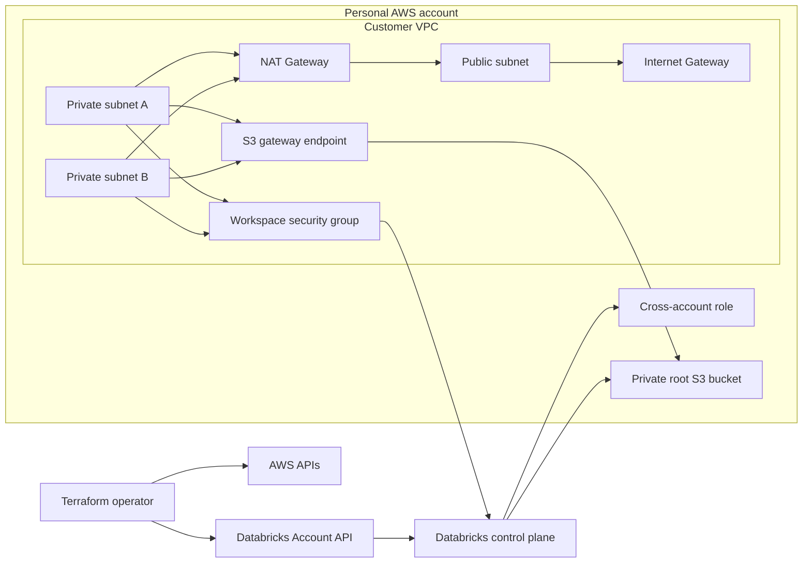

# Architecture diagram

```mermaid
flowchart LR
    TF[Terraform operator] --> AWSAPI[AWS APIs]
    TF --> DBAPI[Databricks Account API]

    subgraph AWS[Personal AWS account]
        ROLE[Cross-account role]
        ROOT[Private root S3 bucket]
        subgraph VPC[Customer VPC]
            PUBLIC[Public subnet]
            NAT[NAT Gateway]
            PRIVATEA[Private subnet A]
            PRIVATEB[Private subnet B]
            SG[Workspace security group]
            S3EP[S3 gateway endpoint]
            IGW[Internet Gateway]
        end
    end

    DBAPI --> CP[Databricks control plane]
    CP --> ROLE
    CP --> ROOT
    PRIVATEA --> SG
    PRIVATEB --> SG
    PRIVATEA --> NAT
    PRIVATEB --> NAT
    NAT --> PUBLIC
    PUBLIC --> IGW
    PRIVATEA --> S3EP
    PRIVATEB --> S3EP
    S3EP --> ROOT
    SG --> CP
```

The diagram shows future Classic Compute network paths. The Terraform project
does not create compute nodes.
